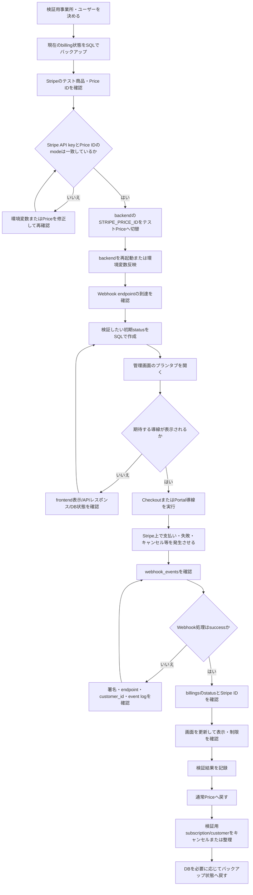
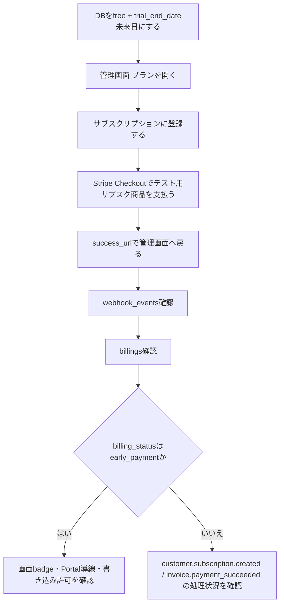
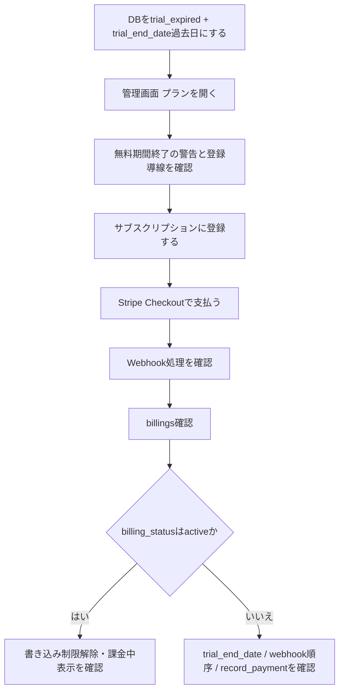
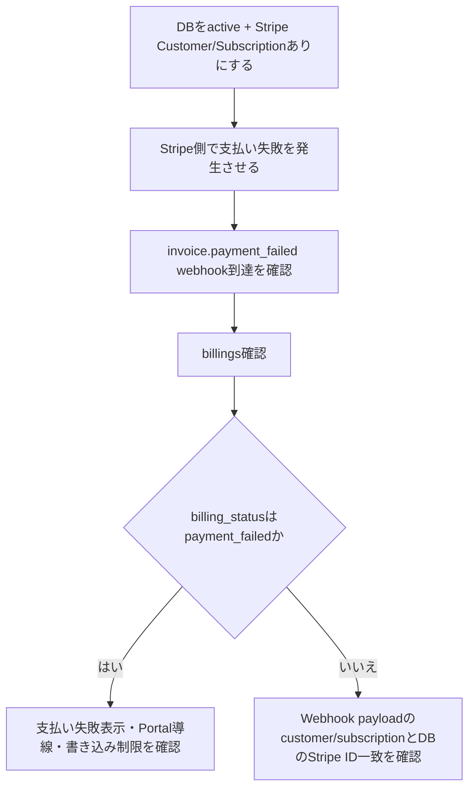
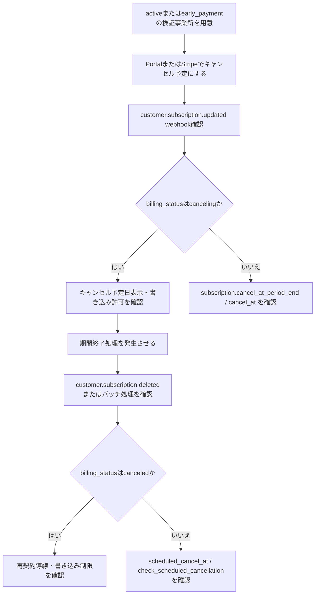
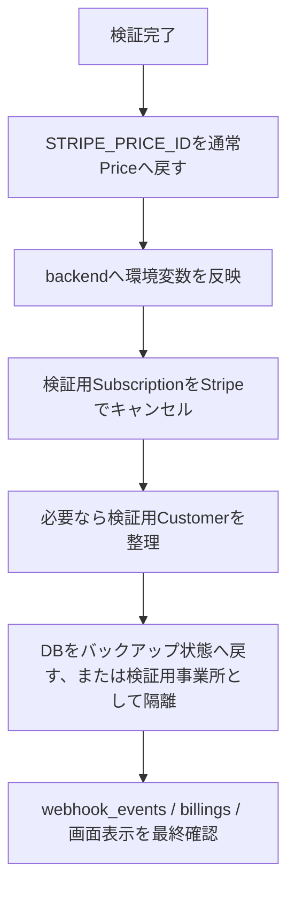

# Billing Status 手動テスト手順

作成日: 2026-06-18

## 目的

`billing_status` の各状態を手動で作り、backend / frontend の表示・制限・導線を確認する。

対象status:

```text
free
early_payment
active
trial_expired
payment_failed
past_due
canceling
canceled
```

`past_due` は後方互換用として残す。新規遷移では原則 `trial_expired` / `payment_failed` を使う。

## 前提

- DB反映は Alembic コマンドではなく、`k_back/migrations/sql/` 配下のSQLを手動実行する運用。
- Python や pytest が必要な場合は Docker backend コンテナ内で実行する。
- 手動テスト前に、対象事業所の `office_id` と `billing_id` を特定する。
- Stripe Portal / Checkout の実導線まで確認する場合、`stripe_customer_id` / `stripe_subscription_id` は実際のStripeテスト環境と対応する値を使う。
- DB表示だけを確認する場合は、Stripe ID はダミーでもよい。ただし Portal / 解約 / Webhook 突合せは失敗する。

## 事前確認SQL

### 対象billingを探す

```sql
SELECT
  b.id AS billing_id,
  b.office_id,
  o.name AS office_name,
  b.billing_status::text AS billing_status,
  b.trial_start_date,
  b.trial_end_date,
  b.stripe_customer_id,
  b.stripe_subscription_id,
  b.subscription_start_date,
  b.last_payment_date,
  b.scheduled_cancel_at,
  b.updated_at
FROM billings b
JOIN offices o ON o.id = b.office_id
ORDER BY b.updated_at DESC
LIMIT 20;
```

### 現在のstatus件数

```sql
SELECT billing_status::text AS billing_status, COUNT(*) AS count
FROM billings
GROUP BY billing_status::text
ORDER BY billing_status::text;
```

### CHECK制約確認

```sql
SELECT conname, pg_get_constraintdef(oid) AS definition
FROM pg_constraint
WHERE conrelid = 'billings'::regclass
  AND conname = 'ck_billings_billing_status';
```

期待値:

```text
free
early_payment
active
past_due
trial_expired
payment_failed
canceling
canceled
```

## バックアップSQL

手動変更前に対象billingを一時テーブルへ退避する。

```sql
DROP TABLE IF EXISTS tmp_billing_status_manual_backup;

CREATE TEMP TABLE tmp_billing_status_manual_backup AS
SELECT *
FROM billings
WHERE office_id = '<OFFICE_ID>'::uuid;

SELECT
  id,
  office_id,
  billing_status::text,
  trial_end_date,
  stripe_customer_id,
  stripe_subscription_id
FROM tmp_billing_status_manual_backup;
```

## 共通確認SQL

各statusへ変更後、以下で確認する。

```sql
SELECT
  id AS billing_id,
  office_id,
  billing_status::text AS billing_status,
  trial_start_date,
  trial_end_date,
  stripe_customer_id,
  stripe_subscription_id,
  subscription_start_date,
  next_billing_date,
  last_payment_date,
  scheduled_cancel_at,
  updated_at
FROM billings
WHERE office_id = '<OFFICE_ID>'::uuid;
```

画面側は以下を確認する。

- 管理画面 > プラン: badge、警告文、表示ボタン
- 利用者ダッシュボード: 警告表示、編集可否
- 保護対象操作: 新規作成・編集・削除ボタンが期待どおり有効/無効か
- 支払いアクション: Checkout / Portal の導線が期待どおり表示されるか

## Status別 手動設定SQL

### 1. free

意味:

- trial中、未課金
- 書き込み許可
- サブスクリプション登録導線を表示

SQL:

```sql
BEGIN;

UPDATE billings
SET
  billing_status = 'free',
  trial_start_date = now() - interval '1 day',
  trial_end_date = now() + interval '14 days',
  stripe_customer_id = NULL,
  stripe_subscription_id = NULL,
  subscription_start_date = NULL,
  next_billing_date = NULL,
  last_payment_date = NULL,
  scheduled_cancel_at = NULL,
  updated_at = now()
WHERE office_id = '<OFFICE_ID>'::uuid;

COMMIT;
```

確認:

- プラン画面で「無料トライアル中」。
- trial残日数が表示される。
- サブスクリプション登録ボタンが表示される。
- 書き込み操作は可能。

### 2. early_payment

意味:

- trial中、課金設定済み
- trial終了までは無料利用
- 書き込み許可

SQL:

```sql
BEGIN;

UPDATE billings
SET
  billing_status = 'early_payment',
  trial_start_date = now() - interval '7 days',
  trial_end_date = now() + interval '14 days',
  stripe_customer_id = 'cus_manual_test_early_payment',
  stripe_subscription_id = 'sub_manual_test_early_payment',
  subscription_start_date = now(),
  next_billing_date = now() + interval '14 days',
  last_payment_date = now(),
  scheduled_cancel_at = NULL,
  updated_at = now()
WHERE office_id = '<OFFICE_ID>'::uuid;

COMMIT;
```

確認:

- プラン画面で「課金完了」または早期支払い完了の意味で表示される。
- trial残日数が表示される。
- 支払い方法変更・解約導線が表示される。
- 書き込み操作は可能。

### 3. active

意味:

- trial終了後、課金中
- 書き込み許可

SQL:

```sql
BEGIN;

UPDATE billings
SET
  billing_status = 'active',
  trial_start_date = now() - interval '190 days',
  trial_end_date = now() - interval '10 days',
  stripe_customer_id = 'cus_manual_test_active',
  stripe_subscription_id = 'sub_manual_test_active',
  subscription_start_date = now() - interval '10 days',
  next_billing_date = now() + interval '20 days',
  last_payment_date = now() - interval '10 days',
  scheduled_cancel_at = NULL,
  updated_at = now()
WHERE office_id = '<OFFICE_ID>'::uuid;

COMMIT;
```

確認:

- プラン画面で「課金中」または課金設定済み。
- 支払い方法変更・解約導線が表示される。
- サブスクリプション登録導線は基本表示されない。
- 書き込み操作は可能。

### 4. trial_expired

意味:

- trial終了後、未課金
- 旧 `past_due` のうち、subscriptionなしの期限切れ状態
- 書き込み制限対象
- サブスクリプション登録を促す

SQL:

```sql
BEGIN;

UPDATE billings
SET
  billing_status = 'trial_expired',
  trial_start_date = now() - interval '190 days',
  trial_end_date = now() - interval '10 days',
  stripe_customer_id = NULL,
  stripe_subscription_id = NULL,
  subscription_start_date = NULL,
  next_billing_date = NULL,
  last_payment_date = NULL,
  scheduled_cancel_at = NULL,
  updated_at = now()
WHERE office_id = '<OFFICE_ID>'::uuid;

COMMIT;
```

確認:

- プラン画面で「無料期間終了」として表示される。
- 支払い失敗ではなく、サブスクリプション登録が必要な状態として表示される。
- サブスクリプション登録導線が表示される。
- 新規作成・編集・削除などの保護対象操作が無効化される。
- backendの保護APIは 402 を返す。

### 5. payment_failed

意味:

- 支払い失敗、請求失敗
- 旧 `past_due` のうち、Stripe invoice/payment failure 由来の状態
- 書き込み制限対象
- 支払い方法更新を促す

SQL:

```sql
BEGIN;

UPDATE billings
SET
  billing_status = 'payment_failed',
  trial_start_date = now() - interval '190 days',
  trial_end_date = now() - interval '10 days',
  stripe_customer_id = 'cus_manual_test_payment_failed',
  stripe_subscription_id = 'sub_manual_test_payment_failed',
  subscription_start_date = now() - interval '40 days',
  next_billing_date = now() - interval '1 day',
  last_payment_date = now() - interval '40 days',
  scheduled_cancel_at = NULL,
  updated_at = now()
WHERE office_id = '<OFFICE_ID>'::uuid;

COMMIT;
```

確認:

- プラン画面で「支払い失敗」として表示される。
- 無料期間終了ではなく、支払い方法更新が必要な状態として表示される。
- 支払い方法変更・再決済導線が表示される。
- 新規作成・編集・削除などの保護対象操作が無効化される。
- backendの保護APIは 402 を返す。

### 6. past_due

意味:

- 後方互換用
- 既存データの互換表示として残す
- 新規遷移では原則使わない
- 書き込み制限対象

SQL:

```sql
BEGIN;

UPDATE billings
SET
  billing_status = 'past_due',
  trial_start_date = now() - interval '190 days',
  trial_end_date = now() - interval '10 days',
  stripe_customer_id = 'cus_manual_test_past_due',
  stripe_subscription_id = NULL,
  subscription_start_date = NULL,
  next_billing_date = NULL,
  last_payment_date = NULL,
  scheduled_cancel_at = NULL,
  updated_at = now()
WHERE office_id = '<OFFICE_ID>'::uuid;

COMMIT;
```

確認:

- 互換表示として既存の支払い遅延表示が破綻しない。
- 新規実装で `past_due` 専用分岐を増やしていないことを確認する。
- 書き込み操作は無効化される。
- backendの保護APIは 402 を返す。

### 7. canceling

意味:

- キャンセル予定
- 期間終了までは利用可能
- 書き込み許可

SQL:

```sql
BEGIN;

UPDATE billings
SET
  billing_status = 'canceling',
  trial_start_date = now() - interval '190 days',
  trial_end_date = now() - interval '10 days',
  stripe_customer_id = 'cus_manual_test_canceling',
  stripe_subscription_id = 'sub_manual_test_canceling',
  subscription_start_date = now() - interval '40 days',
  next_billing_date = now() + interval '20 days',
  last_payment_date = now() - interval '10 days',
  scheduled_cancel_at = now() + interval '20 days',
  updated_at = now()
WHERE office_id = '<OFFICE_ID>'::uuid;

COMMIT;
```

確認:

- プラン画面で「キャンセル予定」。
- キャンセル予定日が表示される。
- 期間終了までは書き込み操作が可能。
- 支払い方法変更・解約またはキャンセル関連導線が破綻しない。

### 8. canceled

意味:

- キャンセル済み
- 書き込み制限対象
- 再契約導線を表示

SQL:

```sql
BEGIN;

UPDATE billings
SET
  billing_status = 'canceled',
  trial_start_date = now() - interval '190 days',
  trial_end_date = now() - interval '10 days',
  stripe_customer_id = 'cus_manual_test_canceled',
  stripe_subscription_id = NULL,
  subscription_start_date = now() - interval '60 days',
  next_billing_date = NULL,
  last_payment_date = now() - interval '40 days',
  scheduled_cancel_at = now() - interval '1 day',
  updated_at = now()
WHERE office_id = '<OFFICE_ID>'::uuid;

COMMIT;
```

確認:

- プラン画面で「キャンセル済み」。
- 再契約またはサブスクリプション登録導線が表示される。
- 新規作成・編集・削除などの保護対象操作が無効化される。
- backendの保護APIは 402 を返す。

## 不整合状態の検知SQL

### trial中なのにpast_due

```sql
SELECT
  id,
  office_id,
  billing_status::text AS billing_status,
  trial_end_date,
  stripe_customer_id,
  stripe_subscription_id
FROM billings
WHERE billing_status = 'past_due'
  AND trial_end_date > now();
```

### trial終了後なのにfree

```sql
SELECT
  id,
  office_id,
  billing_status::text AS billing_status,
  trial_end_date,
  stripe_customer_id,
  stripe_subscription_id
FROM billings
WHERE billing_status = 'free'
  AND trial_end_date <= now();
```

### Customerあり、subscriptionなし、freeのまま

```sql
SELECT
  id,
  office_id,
  billing_status::text AS billing_status,
  trial_end_date,
  stripe_customer_id,
  stripe_subscription_id
FROM billings
WHERE billing_status = 'free'
  AND stripe_customer_id IS NOT NULL
  AND stripe_subscription_id IS NULL;
```

### subscriptionありなのにtrial_expired

```sql
SELECT
  id,
  office_id,
  billing_status::text AS billing_status,
  trial_end_date,
  stripe_customer_id,
  stripe_subscription_id
FROM billings
WHERE billing_status = 'trial_expired'
  AND stripe_subscription_id IS NOT NULL;
```

## 戻しSQL

一時バックアップを作っている場合、同一DBセッション内で以下を実行する。

```sql
BEGIN;

UPDATE billings b
SET
  office_id = backup.office_id,
  stripe_customer_id = backup.stripe_customer_id,
  stripe_subscription_id = backup.stripe_subscription_id,
  billing_status = backup.billing_status,
  trial_start_date = backup.trial_start_date,
  trial_end_date = backup.trial_end_date,
  subscription_start_date = backup.subscription_start_date,
  next_billing_date = backup.next_billing_date,
  current_plan_amount = backup.current_plan_amount,
  last_payment_date = backup.last_payment_date,
  scheduled_cancel_at = backup.scheduled_cancel_at,
  updated_at = now()
FROM tmp_billing_status_manual_backup backup
WHERE b.id = backup.id;

COMMIT;
```

一時テーブルがない場合は、対象statusを安全な状態へ戻す。

```sql
BEGIN;

UPDATE billings
SET
  billing_status = 'free',
  trial_start_date = now(),
  trial_end_date = now() + interval '180 days',
  stripe_customer_id = NULL,
  stripe_subscription_id = NULL,
  subscription_start_date = NULL,
  next_billing_date = NULL,
  last_payment_date = NULL,
  scheduled_cancel_at = NULL,
  updated_at = now()
WHERE office_id = '<OFFICE_ID>'::uuid;

COMMIT;
```

## 本番環境でStripeテスト用サブスク商品を使う検証フロー

本番環境で検証する場合は、通常商品とは別にStripe上で作成したテスト用サブスク商品・Priceを使う。

目的:

- 本番環境のCheckout / Webhook / DB更新 / frontend表示の一連の流れを確認する。
- 実ユーザー向けの商品・Price・本番課金データへ影響を出さない。
- `free -> early_payment`、`trial_expired -> Checkout -> active/payment_failed` などの実導線を確認する。

前提:

- Stripe上に本番環境用のテスト商品・テストPriceを作成済み。
- backend の `STRIPE_PRICE_ID` を検証時だけテストPriceへ差し替えられる。
- Webhook endpoint が本番backendへ到達している。
- 検証用の事業所・ユーザーを用意している。
- 検証完了後に `STRIPE_PRICE_ID` を通常Priceへ戻す手順が決まっている。

注意:

- 本番環境でテストする場合でも、実カード・実顧客へ影響する操作は避ける。
- Stripeの本番モードでテスト商品を使う場合、決済は実決済になり得る。検証用の決済方法・返金・キャンセル手順を事前に決める。
- Stripe test mode の商品を本番環境から使う構成にする場合は、backend のStripe API keyもtest mode用である必要がある。Price IDとAPI keyのmode不一致はCheckout作成失敗の原因になる。
- 検証中にDBを直接更新した場合は、必ず戻しSQLを実行する。

### 全体フロー



### ケース1: trial中のサブスク登録

期待:

- 初期状態は `free`
- Checkout完了後、Webhookにより `early_payment`
- `stripe_customer_id` と `stripe_subscription_id` が保存される
- 書き込み操作は可能

初期状態SQL:

```sql
BEGIN;

UPDATE billings
SET
  billing_status = 'free',
  trial_start_date = now() - interval '1 day',
  trial_end_date = now() + interval '14 days',
  stripe_customer_id = NULL,
  stripe_subscription_id = NULL,
  subscription_start_date = NULL,
  next_billing_date = NULL,
  last_payment_date = NULL,
  scheduled_cancel_at = NULL,
  updated_at = now()
WHERE office_id = '<OFFICE_ID>'::uuid;

COMMIT;
```

フロー:



確認SQL:

```sql
SELECT
  b.billing_status::text,
  b.trial_end_date,
  b.stripe_customer_id,
  b.stripe_subscription_id,
  b.subscription_start_date,
  b.last_payment_date,
  b.updated_at
FROM billings b
WHERE b.office_id = '<OFFICE_ID>'::uuid;
```

Webhook確認SQL:

```sql
SELECT
  event_id,
  event_type,
  status,
  processed_at,
  error_message
FROM webhook_events
WHERE event_type IN ('customer.subscription.created', 'invoice.payment_succeeded')
ORDER BY created_at DESC
LIMIT 20;
```

### ケース2: trial終了後・未課金からサブスク登録

期待:

- 初期状態は `trial_expired`
- Checkout完了後、trial終了後なので `active`
- 書き込み操作が再度可能になる

初期状態SQL:

```sql
BEGIN;

UPDATE billings
SET
  billing_status = 'trial_expired',
  trial_start_date = now() - interval '190 days',
  trial_end_date = now() - interval '10 days',
  stripe_customer_id = NULL,
  stripe_subscription_id = NULL,
  subscription_start_date = NULL,
  next_billing_date = NULL,
  last_payment_date = NULL,
  scheduled_cancel_at = NULL,
  updated_at = now()
WHERE office_id = '<OFFICE_ID>'::uuid;

COMMIT;
```

フロー:



確認SQL:

```sql
SELECT
  billing_status::text,
  trial_end_date,
  stripe_customer_id,
  stripe_subscription_id,
  subscription_start_date,
  last_payment_date
FROM billings
WHERE office_id = '<OFFICE_ID>'::uuid;
```

### ケース3: 支払い失敗

期待:

- Stripe側で支払い失敗イベントを発生させる
- `invoice.payment_failed` のWebhook処理後、`payment_failed`
- 支払い方法更新導線が表示される
- 書き込み操作は制限される

初期状態SQL:

```sql
BEGIN;

UPDATE billings
SET
  billing_status = 'active',
  trial_start_date = now() - interval '190 days',
  trial_end_date = now() - interval '10 days',
  stripe_customer_id = '<STRIPE_CUSTOMER_ID>',
  stripe_subscription_id = '<STRIPE_SUBSCRIPTION_ID>',
  subscription_start_date = now() - interval '40 days',
  next_billing_date = now() - interval '1 day',
  last_payment_date = now() - interval '40 days',
  scheduled_cancel_at = NULL,
  updated_at = now()
WHERE office_id = '<OFFICE_ID>'::uuid;

COMMIT;
```

フロー:



Webhook確認SQL:

```sql
SELECT
  event_id,
  event_type,
  status,
  processed_at,
  error_message
FROM webhook_events
WHERE event_type = 'invoice.payment_failed'
ORDER BY created_at DESC
LIMIT 20;
```

DB確認SQL:

```sql
SELECT
  billing_status::text,
  trial_end_date,
  stripe_customer_id,
  stripe_subscription_id,
  next_billing_date,
  last_payment_date
FROM billings
WHERE office_id = '<OFFICE_ID>'::uuid;
```

### ケース4: キャンセル予定からキャンセル済み

期待:

- PortalまたはStripe側で `cancel_at_period_end=true`
- Webhook処理後、`canceling`
- 期間終了後のバッチまたはWebhookで `canceled`

フロー:



確認SQL:

```sql
SELECT
  billing_status::text,
  stripe_customer_id,
  stripe_subscription_id,
  scheduled_cancel_at,
  updated_at
FROM billings
WHERE office_id = '<OFFICE_ID>'::uuid;
```

### 本番検証後の復旧フロー



復旧確認SQL:

```sql
SELECT
  b.id,
  b.office_id,
  o.name AS office_name,
  b.billing_status::text,
  b.stripe_customer_id,
  b.stripe_subscription_id,
  b.trial_end_date,
  b.updated_at
FROM billings b
JOIN offices o ON o.id = b.office_id
WHERE b.office_id = '<OFFICE_ID>'::uuid;
```

## 手動テスト完了チェックリスト

- [ ] `free` でtrial表示、登録導線、書き込み許可を確認した。
- [ ] `early_payment` でtrial中課金済み表示、Portal導線、書き込み許可を確認した。
- [ ] `active` で課金中表示、Portal導線、書き込み許可を確認した。
- [ ] `trial_expired` で無料期間終了表示、登録導線、書き込み制限を確認した。
- [ ] `payment_failed` で支払い失敗表示、支払い方法更新導線、書き込み制限を確認した。
- [ ] `past_due` で互換表示と書き込み制限を確認した。
- [ ] `canceling` でキャンセル予定表示、予定日表示、書き込み許可を確認した。
- [ ] `canceled` でキャンセル済み表示、再契約導線、書き込み制限を確認した。
- [ ] 不整合検知SQLで意図しないデータが残っていないことを確認した。
- [ ] 手動変更したbillingを元に戻した。
