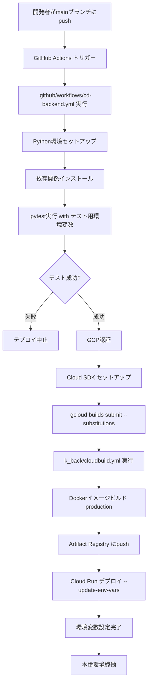

# 環境変数設定ガイド - けいかくん

## 概要

けいかくんでは、新しい環境変数を追加する際に、**3つのファイル**を更新する必要があります。
本番環境へのデプロイは GitHub Actions + Cloud Build の CI/CD パイプラインで行われ、環境変数は以下のフローで渡されます：

```
GitHub Secrets
    ↓
.github/workflows/cd-backend.yml (--substitutions)
    ↓
k_back/cloudbuild.yml (${_変数名})
    ↓
Cloud Run (--update-env-vars)
```

---

## 環境変数設定手順

### 1. GitHub Secretsに環境変数を追加

1. GitHubリポジトリページを開く
2. `Settings` → `Secrets and variables` → `Actions` を選択
3. `New repository secret` をクリック
4. 環境変数名と値を入力して保存

**例**: VAPID関連の環境変数を追加する場合
```
Name: VAPID_PRIVATE_KEY
Value: MIGHAgEAMBMGByqGSM49AgEG...
```

### 2. `.github/workflows/cd-backend.yml` を更新

#### テスト実行時の環境変数設定（任意）

テストで使用する環境変数がある場合、`Run Pytest` ステップの `env` セクションに追加：

```yaml
- name: Run Pytest
  working-directory: ./k_back
  env:
    DATABASE_URL: ${{ secrets.PROD_DATABASE_URL }}
    SECRET_KEY: ${{ secrets.TEST_SECRET_KEY }}
    # ここに追加
    VAPID_PRIVATE_KEY: ${{ secrets.VAPID_PRIVATE_KEY }}
    VAPID_PUBLIC_KEY: ${{ secrets.VAPID_PUBLIC_KEY }}
    VAPID_SUBJECT: ${{ secrets.VAPID_SUBJECT }}
  run: pytest
```

#### Cloud Buildへの環境変数受け渡し（必須）

`Deploy to Cloud Run using Cloud Build` ステップの `--substitutions` パラメータに追加：

```yaml
- name: Deploy to Cloud Run using Cloud Build
  id: deploy
  working-directory: ./k_back
  run: |
    gcloud builds submit \
      --config cloudbuild.yml \
      --substitutions=_PROD_DATABASE_URL="${{ secrets.PROD_DATABASE_URL }}",_PROD_SECRET_KEY="${{ secrets.PROD_SECRET_KEY }}",...,_VAPID_PRIVATE_KEY="${{ secrets.VAPID_PRIVATE_KEY }}",_VAPID_PUBLIC_KEY="${{ secrets.VAPID_PUBLIC_KEY }}",_VAPID_SUBJECT="${{ secrets.VAPID_SUBJECT }}" \
      .
```

**重要**:
- 変数名の先頭に `_` を付ける（例: `_VAPID_PRIVATE_KEY`）
- カンマ区切りで追加（改行しない）
- エスケープに注意（`"${{ secrets.変数名 }}"`）

### 3. `k_back/cloudbuild.yml` を更新

Cloud Runへのデプロイ時に環境変数を設定します。

`--update-env-vars` パラメータに追加（`##` 区切り）：

```yaml
- name: 'gcr.io/google.com/cloudsdktool/cloud-sdk'
  entrypoint: gcloud
  args:
    - 'run'
    - 'deploy'
    - 'k-back'
    - '--image'
    - 'asia-northeast1-docker.pkg.dev/$PROJECT_ID/k-back-repo/k-back:latest'
    - '--region'
    - 'asia-northeast1'
    - '--platform'
    - 'managed'
    - '--allow-unauthenticated'
    - '--update-env-vars'
    - '^##^DATABASE_URL=${_PROD_DATABASE_URL}##SECRET_KEY=${_PROD_SECRET_KEY}##...##VAPID_PRIVATE_KEY=${_VAPID_PRIVATE_KEY}##VAPID_PUBLIC_KEY=${_VAPID_PUBLIC_KEY}##VAPID_SUBJECT=${_VAPID_SUBJECT}'
```

**重要**:
- Cloud Build substitutions で受け取った `${_変数名}` を使用
- `##` 区切りで追加
- 先頭に `^##^` を付ける
- 改行しない（1行で記述）

---

## 環境変数の種類と設定場所

### バックエンド環境変数

| カテゴリ | 環境変数名 | 設定場所 |
|---------|-----------|---------|
| **データベース** | `DATABASE_URL` | GitHub Secrets → cd-backend.yml → cloudbuild.yml |
| **認証** | `SECRET_KEY` | GitHub Secrets → cd-backend.yml → cloudbuild.yml |
| **AWS S3** | `AWS_ACCESS_KEY_ID`<br>`AWS_SECRET_ACCESS_KEY`<br>`S3_BUCKET_NAME` | GitHub Secrets → cd-backend.yml → cloudbuild.yml |
| **メール** | `MAIL_USERNAME`<br>`MAIL_PASSWORD`<br>`MAIL_SERVER`<br>`MAIL_PORT` | GitHub Secrets → cd-backend.yml → cloudbuild.yml |
| **Stripe** | `STRIPE_SECRET_KEY`<br>`STRIPE_WEBHOOK_SECRET`<br>`STRIPE_PRICE_ID` | GitHub Secrets → cd-backend.yml → cloudbuild.yml |
| **VAPID (Web Push)** | `VAPID_PRIVATE_KEY`<br>`VAPID_PUBLIC_KEY`<br>`VAPID_SUBJECT` | GitHub Secrets → cd-backend.yml → cloudbuild.yml |
| **カレンダー** | `CALENDAR_ENCRYPTION_KEY` | GitHub Secrets → cd-backend.yml → cloudbuild.yml |
| **フロントエンド** | `FRONTEND_URL` | GitHub Secrets → cd-backend.yml → cloudbuild.yml |
| **Cookie設定** | `COOKIE_SECURE`<br>`COOKIE_DOMAIN`<br>`COOKIE_SAMESITE` | GitHub Secrets → cd-backend.yml → cloudbuild.yml |
| **レート制限** | `RATE_LIMIT_FORGOT_PASSWORD`<br>`RATE_LIMIT_RESEND_EMAIL` | GitHub Secrets → cd-backend.yml → cloudbuild.yml |

### フロントエンド環境変数

フロントエンド（Next.js）の環境変数は別の仕組みで管理されます：

| 環境変数名 | 設定場所 | 用途 |
|-----------|---------|------|
| `NEXT_PUBLIC_API_URL` | `.env.local` (開発)<br>Vercel/Cloud Run環境変数 (本番) | API エンドポイント |
| `NEXT_PUBLIC_VAPID_PUBLIC_KEY` | `.env.local` (開発)<br>Vercel/Cloud Run環境変数 (本番) | Web Push公開鍵 |

**注**: `NEXT_PUBLIC_` プレフィックスは必須（クライアント側で参照可能）

---

## 実際の設定例: VAPID環境変数を追加

### ステップ1: GitHub Secretsに追加

```
Name: VAPID_PRIVATE_KEY
Value: MIGHAgEAMBMGByqGSM49AgEGCCqGSM49AwEHBG0wawIBAQQgk8A4...

Name: VAPID_PUBLIC_KEY
Value: BBmBnPkVV0X-PdBZRYBr1Yra2xzkRIKuhHyEwJZObLoNTQtYxTiw...

Name: VAPID_SUBJECT
Value: mailto:support@keikakun.com
```

### ステップ2: `.github/workflows/cd-backend.yml` の修正

#### テスト環境変数に追加（38行目付近）

```diff
- name: Run Pytest
  working-directory: ./k_back
  env:
    DATABASE_URL: ${{ secrets.PROD_DATABASE_URL }}
    TEST_DATABASE_URL: ${{ secrets.TEST_DATABASE_URL }}
    SECRET_KEY: ${{ secrets.TEST_SECRET_KEY }}
    # ... 他の環境変数 ...
+   VAPID_PRIVATE_KEY: ${{ secrets.VAPID_PRIVATE_KEY }}
+   VAPID_PUBLIC_KEY: ${{ secrets.VAPID_PUBLIC_KEY }}
+   VAPID_SUBJECT: ${{ secrets.VAPID_SUBJECT }}
  run: pytest
```

#### Cloud Build substitutions に追加（76-78行目）

```diff
gcloud builds submit \
  --config cloudbuild.yml \
- --substitutions=_PROD_DATABASE_URL="${{ secrets.PROD_DATABASE_URL }}",_PROD_SECRET_KEY="${{ secrets.PROD_SECRET_KEY }}",_AWS_ACCESS_KEY_ID="${{ secrets.AWS_ACCESS_KEY_ID }}",...,_STRIPE_PRICE_ID="${{ secrets.STRIPE_PRICE_ID }}" \
+ --substitutions=_PROD_DATABASE_URL="${{ secrets.PROD_DATABASE_URL }}",_PROD_SECRET_KEY="${{ secrets.PROD_SECRET_KEY }}",_AWS_ACCESS_KEY_ID="${{ secrets.AWS_ACCESS_KEY_ID }}",...,_STRIPE_PRICE_ID="${{ secrets.STRIPE_PRICE_ID }}",_VAPID_PRIVATE_KEY="${{ secrets.VAPID_PRIVATE_KEY }}",_VAPID_PUBLIC_KEY="${{ secrets.VAPID_PUBLIC_KEY }}",_VAPID_SUBJECT="${{ secrets.VAPID_SUBJECT }}" \
  .
```

### ステップ3: `k_back/cloudbuild.yml` の修正（32行目）

```diff
- '--update-env-vars'
- '^##^DATABASE_URL=${_PROD_DATABASE_URL}##SECRET_KEY=${_PROD_SECRET_KEY}##...##STRIPE_PRICE_ID=${_STRIPE_PRICE_ID}##MAIL_STARTTLS=True##MAIL_SSL_TLS=False##MAIL_DEBUG=0'
+ '^##^DATABASE_URL=${_PROD_DATABASE_URL}##SECRET_KEY=${_PROD_SECRET_KEY}##...##STRIPE_PRICE_ID=${_STRIPE_PRICE_ID}##VAPID_PRIVATE_KEY=${_VAPID_PRIVATE_KEY}##VAPID_PUBLIC_KEY=${_VAPID_PUBLIC_KEY}##VAPID_SUBJECT=${_VAPID_SUBJECT}##MAIL_STARTTLS=True##MAIL_SSL_TLS=False##MAIL_DEBUG=0'
```

### ステップ4: コミット・プッシュ

```bash
git add .github/workflows/cd-backend.yml k_back/cloudbuild.yml
git commit -m "feat: VAPID環境変数をCI/CDパイプラインに追加"
git push origin main
```

### ステップ5: デプロイ確認

1. GitHub Actions の実行ログを確認
2. Cloud Build の実行ログを確認
3. Cloud Run の環境変数が正しく設定されているか確認

```bash
gcloud run services describe k-back \
  --region=asia-northeast1 \
  --format="value(spec.template.spec.containers[0].env)"
```

---

## トラブルシューティング

### エラー: Invalid substitution variable

**原因**: `--substitutions` のフォーマットが不正

**解決策**:
- 変数名の先頭に `_` があることを確認
- カンマ区切りが正しいか確認（スペース不要）
- エスケープが正しいか確認（`"${{ secrets.変数名 }}"`）

### エラー: Cloud Run deployment failed

**原因**: `cloudbuild.yml` の環境変数設定が不正

**解決策**:
- `##` 区切りが正しいか確認
- 変数名が `${_変数名}` 形式になっているか確認
- 先頭に `^##^` があるか確認

### エラー: Environment variable not found

**原因**: GitHub Secrets に環境変数が設定されていない

**解決策**:
- GitHub Secrets に環境変数を追加
- Secrets名のタイポを確認
- リポジトリの権限を確認（Secretsへのアクセス権限）

### デプロイ後に環境変数が反映されない

**確認手順**:

1. **Cloud Run の環境変数を確認**:
   ```bash
   gcloud run services describe k-back \
     --region=asia-northeast1 \
     --format="value(spec.template.spec.containers[0].env)" \
     | grep VAPID
   ```

2. **Cloud Build の実行ログを確認**:
   - GCPコンソール → Cloud Build → 履歴
   - `--update-env-vars` の内容を確認

3. **GitHub Actions の実行ログを確認**:
   - GitHub → Actions タブ
   - 最新のワークフロー実行ログをチェック

---

## ベストプラクティス

### 1. 機密情報の取り扱い

- **絶対に** `.env` ファイルをGitコミットしない
- `.gitignore` に `.env`, `.env.local` を追加済み
- GitHub Secrets に機密情報を保存
- ローカル開発用の `.env.example` を用意（値は空）

### 2. 環境変数の命名規則

- **バックエンド**: `UPPER_SNAKE_CASE`
  - 例: `DATABASE_URL`, `SECRET_KEY`

- **フロントエンド（Next.js）**: `NEXT_PUBLIC_` プレフィックス
  - 例: `NEXT_PUBLIC_API_URL`

### 3. 環境変数の検証

新しい環境変数を追加したら、以下を確認：

```python
# k_back/app/core/config.py
from pydantic_settings import BaseSettings

class Settings(BaseSettings):
    # 新しい環境変数を追加
    VAPID_PRIVATE_KEY: str
    VAPID_PUBLIC_KEY: str
    VAPID_SUBJECT: str

    class Config:
        env_file = ".env"
        case_sensitive = True
```

### 4. ドキュメント更新

環境変数を追加したら、以下のドキュメントを更新：
- [ ] `README.md` (環境構築手順)
- [ ] `tech_stack.md` (技術スタック)
- [ ] このファイル (`environment_variables_setup.md`)

### 5. チーム共有

新しい環境変数を追加したら、チームメンバーに通知：
- ローカル開発環境の `.env` ファイル更新が必要
- GitHub Secrets の設定権限を持つメンバーに依頼

---

## CI/CDパイプライン全体像



---

## 参考リンク

- [GitHub Actions Secrets](https://docs.github.com/en/actions/security-guides/encrypted-secrets)
- [Cloud Build Substitutions](https://cloud.google.com/build/docs/configuring-builds/substitute-variable-values)
- [Cloud Run Environment Variables](https://cloud.google.com/run/docs/configuring/environment-variables)
- [Pydantic Settings](https://docs.pydantic.dev/latest/concepts/pydantic_settings/)

---

## チェックリスト

新しい環境変数を追加する際の確認リスト：

- [ ] **GitHub Secrets に環境変数を追加**
- [ ] **`.github/workflows/cd-backend.yml` の `Run Pytest` env セクションに追加（テストで使う場合）**
- [ ] **`.github/workflows/cd-backend.yml` の `--substitutions` に追加**
- [ ] **`k_back/cloudbuild.yml` の `--update-env-vars` に追加**
- [ ] **`k_back/app/core/config.py` に型定義を追加**
- [ ] **ローカル開発用の `.env` ファイルに追加**
- [ ] **`.env.example` に追加（値は空）**
- [ ] **関連ドキュメントを更新**
- [ ] **コミット・プッシュ**
- [ ] **GitHub Actions の実行ログを確認**
- [ ] **Cloud Build の実行ログを確認**
- [ ] **Cloud Run の環境変数を確認**
- [ ] **本番環境での動作確認**

---

**最終更新**: 2026-01-20
**作成者**: Claude Sonnet 4.5
