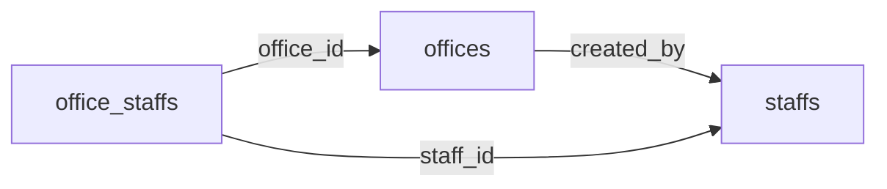

# 現在のタスク: snapshot_manager テスト修正

**タスクID**: snapshot_manager_fix
**優先度**: 🔴 High
**ステータス**: 🔧 進行中
**担当**: Claude Sonnet 4.5

---

## 📌 タスク概要

ローカル環境で失敗している `test_snapshot_manager.py` の3つのテストを修正する。

**失敗テスト**:
1. `test_snapshot_create_and_restore`
2. `test_snapshot_list`
3. `test_snapshot_performance_comparison`

**根本原因**: 外部キー制約エラー - テーブル削除順序の問題

---

## 🔍 問題分析

### 外部キー制約の構造



- `offices.created_by` → `staffs.id` (NOT NULL)
- `office_staffs.office_id` → `offices.id`
- `office_staffs.staff_id` → `staffs.id`

### 削除時のルール

**PostgreSQL外部キー制約**:
- 参照している側（child）を先に削除
- 参照されている側（parent）を後に削除

**正しい削除順序**:
```
1. office_staffs  (offices と staffs を参照)
2. offices        (staffs.id を参照)
3. staffs         (参照される側、最後)
```

**間違った削除順序（エラー発生）**:
```
1. office_staffs
2. staffs         ← ここで削除すると...
3. offices        ← offices.created_by が存在しないstaffを参照してエラー
```

---

## 🛠️ 修正内容

### 修正1: `snapshot_manager.py:_clean_test_data()` ✅ 完了

**ファイル**: `tests/performance/snapshot_manager.py`
**行番号**: 372-394

**Before**:
```python
async def _clean_test_data(db: AsyncSession):
    """
    テストデータを全削除

    依存関係の逆順で削除（外部キー制約エラー回避）
    """
    tables = [
        "support_plan_cycles",
        "office_welfare_recipients",
        "welfare_recipients",
        "office_staffs",
        "staffs",    # ❌ 問題: staffs を先に削除
        "offices",   # ❌ offices.created_by が参照エラー
    ]
```

**After**:
```python
async def _clean_test_data(db: AsyncSession):
    """
    テストデータを全削除

    依存関係の逆順で削除（外部キー制約エラー回避）

    Note: 依存関係の順序
    - offices.created_by → staffs.id
    - office_staffs → staffs.id, offices.id
    - したがって、offices → office_staffs → staffs の順で削除
    """
    tables = [
        "support_plan_cycles",
        "office_welfare_recipients",
        "welfare_recipients",
        "office_staffs",
        "offices",   # ✅ staffs より先に削除（created_by 外部キー制約）
        "staffs",
    ]
```

**修正日時**: 2026-02-12
**ステータス**: ✅ 完了

---

### 修正2: `test_snapshot_manager.py:76-87` ✅ 確認済み

**ファイル**: `tests/performance/test_snapshot_manager.py`
**行番号**: 76-87
**テスト関数**: `test_snapshot_create_and_restore`

**コード**:
```python
# Step 3: テストデータを削除（外部キー制約を考慮した順序）
print("\n🗑️ Step 3: テストデータ削除")
from sqlalchemy import delete as sql_delete
from app.models import OfficeStaff
# 依存関係の逆順で削除
# 1. office_staffs (association)
# 2. offices (offices.created_by → staffs.id を参照)
# 3. staffs (参照される側なので最後)
await db_session.execute(sql_delete(OfficeStaff).where(OfficeStaff.is_test_data == True))
await db_session.execute(sql_delete(Office).where(Office.is_test_data == True))
await db_session.execute(sql_delete(Staff).where(Staff.is_test_data == True))
await db_session.commit()
```

**ステータス**: ✅ 順序は正しい（コメントのみ修正済み）

---

### 修正3: `test_snapshot_manager.py:148-155` ✅ 確認済み

**ファイル**: `tests/performance/test_snapshot_manager.py`
**行番号**: 148-155
**テスト関数**: `test_snapshot_list`

**コード**:
```python
# データをクリーンアップ（外部キー制約を考慮）
from sqlalchemy import delete as sql_delete
from app.models import OfficeStaff
await db_session.execute(sql_delete(OfficeStaff).where(OfficeStaff.is_test_data == True))
await db_session.execute(sql_delete(Office).where(Office.is_test_data == True))
await db_session.execute(sql_delete(Staff).where(Staff.is_test_data == True))
await db_session.commit()
```

**ステータス**: ✅ 順序は正しい

---

### 修正4: `test_snapshot_manager.py:203-207` ⏸️ 修正中断

**ファイル**: `tests/performance/test_snapshot_manager.py`
**行番号**: 203-207
**テスト関数**: `test_snapshot_performance_comparison`

**Before**:
```python
# データ削除
from sqlalchemy import delete as sql_delete
await db_session.execute(sql_delete(Staff).where(Staff.is_test_data == True))   # ❌ 先に削除
await db_session.execute(sql_delete(Office).where(Office.is_test_data == True)) # ❌ offices.created_by がエラー
await db_session.commit()
```

**After（修正案）**:
```python
# データ削除（外部キー制約を考慮した順序）
from sqlalchemy import delete as sql_delete
from app.models import OfficeStaff
await db_session.execute(sql_delete(OfficeStaff).where(OfficeStaff.is_test_data == True))
await db_session.execute(sql_delete(Office).where(Office.is_test_data == True))
await db_session.execute(sql_delete(Staff).where(Staff.is_test_data == True))
await db_session.commit()
```

**ステータス**: ⏸️ ユーザーによりブロック（修正未適用）

**理由**: ユーザーが編集をキャンセル

---

## ✅ 完了チェックリスト

- [x] 問題の根本原因を特定
- [x] 外部キー制約の依存関係を図示
- [x] `snapshot_manager.py:_clean_test_data()` を修正
- [x] `test_snapshot_manager.py:76-87` の順序を確認（正しい）
- [x] `test_snapshot_manager.py:148-155` の順序を確認（正しい）
- [ ] `test_snapshot_manager.py:203-207` を修正（保留中）
- [ ] テスト実行して修正を検証
- [ ] 本番環境にデプロイ

---

## 🚧 ブロッカー

**ブロッカー1**: Docker環境が起動していない
- テストを実行できない
- 修正の検証ができない

**ブロッカー2**: ユーザーによる編集ブロック
- `test_snapshot_manager.py:203-207` の修正が適用されていない
- ユーザーの承認待ち

---

## 📋 次のアクション

### 即座に実行すべきこと
1. ✅ 進捗レポートを作成（完了）
2. ⏳ ユーザーに修正内容を確認してもらう
3. ⏳ `test_snapshot_manager.py:203-207` の修正を適用
4. ⏳ Docker環境でテストを実行

### 修正後の検証手順
```bash
# Step 1: Docker環境の起動確認
docker ps

# Step 2: 個別テスト実行（修正箇所のみ）
cd /Users/naotoyasuda/workspase/keikakun_app/k_back
docker exec keikakun_app-backend-1 pytest tests/performance/test_snapshot_manager.py::test_snapshot_performance_comparison -v

# Step 3: 全snapshot_managerテスト実行
docker exec keikakun_app-backend-1 pytest tests/performance/test_snapshot_manager.py -v

# Step 4: エラーログ確認
# エラーが発生した場合、スタックトレースを確認
```

### 期待される結果
```
tests/performance/test_snapshot_manager.py::test_snapshot_create_and_restore PASSED
tests/performance/test_snapshot_manager.py::test_snapshot_list PASSED
tests/performance/test_snapshot_manager.py::test_snapshot_performance_comparison PASSED

======================== 3 passed in XX.XXs ========================
```

---

## 📚 参考資料

### PostgreSQL外部キー制約
- [PostgreSQL Documentation - Foreign Keys](https://www.postgresql.org/docs/current/ddl-constraints.html#DDL-CONSTRAINTS-FK)
- 削除時の制約: `ON DELETE RESTRICT`（デフォルト）
- 参照されているレコードは削除できない

### SQLAlchemy削除パターン
```python
# パターン1: ORM delete（推奨）
from sqlalchemy import delete as sql_delete
stmt = sql_delete(Model).where(Model.is_test_data == True)
await db.execute(stmt)

# パターン2: Raw SQL（高速だが型安全性なし）
from sqlalchemy import text
query = text("DELETE FROM table WHERE is_test_data = true")
await db.execute(query)
```

### 関連ファイル
- `tests/performance/snapshot_manager.py` (スナップショット管理ユーティリティ)
- `tests/performance/test_snapshot_manager.py` (テストファイル)
- `tests/performance/bulk_factories.py` (バルクデータ生成)

---

**最終更新**: 2026-02-12
**次回更新予定**: 修正適用後
