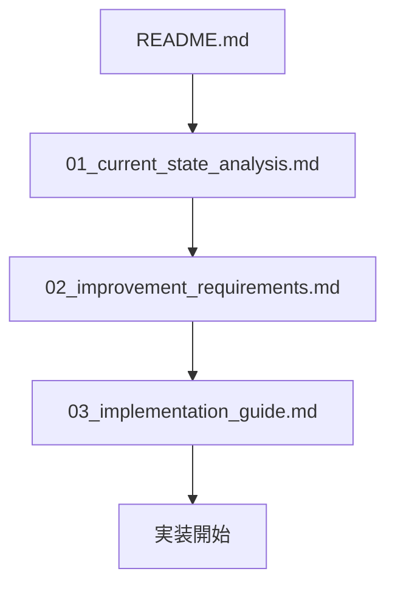

# ダッシュボードフィルター機能 - パフォーマンス最適化プロジェクト

## 📁 ドキュメント構成

| ファイル | 内容 | 対象読者 |
|---------|------|----------|
| `README.md` | プロジェクト概要（このファイル） | 全員 |
| `01_current_state_analysis.md` | 現状分析とボトルネック特定 | Tech Lead, Developer |
| `02_improvement_requirements.md` | 詳細な改善要件定義 | Developer, QA |
| `03_implementation_guide.md` | ステップバイステップ実装手順 | Developer |

---

## 🎯 プロジェクト概要

### 目的
500事業所以上のスケールに耐えうるダッシュボードフィルター機能の実現

### 現状の問題
- **レスポンス時間**: 3-5秒（ユーザー体験悪化）
- **メモリ使用量**: 50MB/リクエスト（スケールしない）
- **同時実行**: 10リクエストで限界
- **データベース負荷**: CPU 80%以上

### 改善目標
- **レスポンス時間**: 300-500ms（**10倍高速化**）
- **メモリ使用量**: 5MB/リクエスト（**90%削減**）
- **同時実行**: 100リクエスト（**10倍向上**）
- **データベース負荷**: CPU 50%以下

---

## 📊 改善施策サマリー

### Phase 1: クエリ最適化（工数: 3時間）

| 施策 | 改善率 | 難易度 |
|------|--------|--------|
| COUNT(*)クエリ化 | 50倍高速化 | ★☆☆ 易 |
| サブクエリ統合 | 40%高速化 | ★★☆ 中 |
| JOIN戦略統一 | コード改善 | ★☆☆ 易 |

### Phase 2: 複合インデックス追加（工数: 50分）

| インデックス | 対象テーブル | 改善率 | 難易度 |
|-------------|------------|--------|--------|
| 最新サイクル検索 | `support_plan_cycles` | 10倍高速化 | ★☆☆ 易 |
| 最新ステータス検索 | `support_plan_statuses` | 10倍高速化 | ★☆☆ 易 |
| ふりがなソート | `welfare_recipients` | 10倍高速化 | ★☆☆ 易 |
| 事業所別検索 | `office_welfare_recipients` | 10倍高速化 | ★☆☆ 易 |

### Phase 3: selectinload 最適化（工数: 4時間40分）

| 施策 | 改善率 | 難易度 |
|------|--------|--------|
| フィルタリング追加 | 75%高速化 | ★★★ 高 |
| EXISTS句への変更 | 30%高速化 | ★★☆ 中 |

---

## 🚀 クイックスタート

### 1. ドキュメントを読む順序



### 2. 実装の優先順位

#### 🔴 最優先（即効性あり）
1. **COUNT(*)クエリ化**（10分）
   - 効果大、リスク低
   - すぐに実装可能

2. **複合インデックス追加**（50分）
   - 効果大、ダウンタイムなし
   - CONCURRENTLY で本番適用可能

#### 🟡 高優先（効果大）
3. **サブクエリ統合**（2時間）
   - 効果大、テスト必要
   - Phase 1 完了後に実施

4. **selectinload最適化**（3時間）
   - 効果大、慎重な実装必要
   - Phase 2 完了後に実施

#### 🟢 中優先（仕上げ）
5. **EXISTS句への変更**（1時間）
   - 効果中、コード改善
   - 時間に余裕があれば実施

---

## 📈 期待される改善効果

### レスポンス時間の変化

```
現状:
┌─────────────────┐
│ 初期表示: 3-5秒  │ ← ユーザー体験悪化
└─────────────────┘

Phase 1 完了後:
┌─────────────────┐
│ 初期表示: 1-2秒  │ ← 50%改善
└─────────────────┘

Phase 2 完了後:
┌─────────────────┐
│ 初期表示: 500ms  │ ← 80%改善
└─────────────────┘

Phase 3 完了後:
┌─────────────────┐
│ 初期表示: 300ms  │ ← 90%改善（目標達成）
└─────────────────┘
```

### メモリ使用量の変化

```
現状:     [██████████████████████████████████████████████████] 50MB

Phase 1:  [█████] 5MB (90%削減)

Phase 2:  [█████] 5MB (維持)

Phase 3:  [███] 2MB (96%削減)
```

---

## ✅ 受け入れ基準

### 機能要件
- ✅ すべてのフィルターが正しく動作する
- ✅ 複合条件（AND）が正しく適用される
- ✅ ソート順が正しく機能する
- ✅ ページネーションが正しく動作する
- ✅ 既存機能に影響がない（回帰テスト）

### 非機能要件
- ✅ **500事業所 × 100利用者**でレスポンス時間 < 500ms
- ✅ **同時10リクエスト**で安定動作
- ✅ **メモリ使用量** < 10MB/リクエスト
- ✅ **データベースCPU使用率** < 50%
- ✅ **インデックス作成時のロック**なし（CONCURRENTLY）

---

## 📅 実装スケジュール

### 推奨タイムライン（総工数: 9時間40分）

| Week | Phase | タスク | 工数 | 累積改善 |
|------|-------|--------|------|----------|
| 1 | Phase 1 + 2 | クエリ最適化 + インデックス | 3時間50分 | 5-8倍 |
| 2 | Phase 3 | selectinload最適化 | 4時間40分 | 10倍 |
| 3 | テスト | パフォーマンステスト + デプロイ | 1時間10分 | - |

### Phase別の詳細スケジュール

#### Week 1: 基盤最適化（工数: 3時間50分）

| Day | 時間 | タスク | 期待効果 |
|-----|------|--------|----------|
| Mon | 10分 | COUNT(*)クエリ化 | メモリ99%削減 |
| Mon | 2時間 | サブクエリ統合 | 40%高速化 |
| Mon | 30分 | JOIN戦略統一 | コード改善 |
| Mon | 50分 | インデックス4件追加 | 10倍高速化 |
| Mon | 20分 | テスト + デプロイ | - |

**Week 1 終了時**: レスポンス時間 3-5秒 → 500ms（**5-10倍改善**）

#### Week 2: 仕上げ（工数: 4時間40分）

| Day | 時間 | タスク | 期待効果 |
|-----|------|--------|----------|
| Mon | 3時間 | selectinload最適化 | 75%高速化 |
| Mon | 1時間 | EXISTS句への変更 | 30%高速化 |
| Mon | 40分 | テスト | - |

**Week 2 終了時**: レスポンス時間 500ms → 300ms（**10倍改善達成**）

#### Week 3: 検証・デプロイ（工数: 2時間）

| Day | 時間 | タスク |
|-----|------|--------|
| Mon | 1時間 | パフォーマンステスト |
| Mon | 30分 | 負荷テスト |
| Mon | 30分 | 本番デプロイ |

---

## 🔍 技術スタック

### 使用技術
- **Backend**: FastAPI + SQLAlchemy (Async) + PostgreSQL
- **ORM**: SQLAlchemy 2.0+ (Async)
- **Database**: PostgreSQL 14+
- **Migration**: Alembic

### 主要なパフォーマンステクニック
1. **COUNT(*)クエリ**: メモリ効率的なカウント
2. **サブクエリ統合**: GROUP BY 操作の削減
3. **部分インデックス**: `WHERE` 条件付きインデックス
4. **selectinload フィルタリング**: 必要最小限のデータロード
5. **EXISTS句**: サブクエリの最適化

---

## 📝 開発者向けメモ

### 重要な注意事項

#### ⚠️ データベース操作
```sql
-- ✅ GOOD: ロックフリーインデックス作成
CREATE INDEX CONCURRENTLY idx_name ON table (column);

-- ❌ BAD: 本番環境でロック発生
CREATE INDEX idx_name ON table (column);
```

#### ⚠️ selectinload の使用
```python
# ✅ GOOD: フィルタリング付き
selectinload(Model.relation).where(condition)

# ❌ BAD: 全データロード
selectinload(Model.relation)
```

#### ⚠️ サブクエリの統合
```python
# ✅ GOOD: 1つのサブクエリで複数情報取得
cycle_info_sq = select(..., ..., ...)

# ❌ BAD: 複数の独立サブクエリ
subq1 = select(...)
subq2 = select(...)
```

### デバッグ Tips

#### SQL ログ有効化
```python
import logging
logging.basicConfig()
logging.getLogger('sqlalchemy.engine').setLevel(logging.INFO)
```

#### クエリプラン確認
```sql
EXPLAIN ANALYZE <query>;
```

#### インデックス使用状況確認
```sql
SELECT * FROM pg_stat_user_indexes
WHERE indexrelname LIKE 'idx_%';
```

---

## 🧪 テスト戦略

### 1. ユニットテスト
- CRUDメソッドの動作確認
- サブクエリ統合の正確性
- フィルタリング条件の検証

### 2. パフォーマンステスト
```python
async def test_dashboard_performance_500_offices():
    """500事業所でのパフォーマンステスト"""
    # Setup: 500事業所 × 100利用者

    start = time.time()
    result = await get_dashboard(...)
    elapsed = time.time() - start

    # 受け入れ基準: 500ms以下
    assert elapsed < 0.5
```

### 3. 負荷テスト
```bash
# locust または Apache Bench で同時リクエスト
ab -n 1000 -c 100 http://localhost:8000/api/v1/dashboard/
```

---

## 📚 参考資料

### 内部ドキュメント
- [現状分析](./01_current_state_analysis.md)
- [改善要件](./02_improvement_requirements.md)
- [実装ガイド](./03_implementation_guide.md)
- [既存検索機能要件](../4_kensaku.md)

### 外部リソース
- [SQLAlchemy Performance](https://docs.sqlalchemy.org/en/20/faq/performance.html)
- [PostgreSQL Indexing](https://www.postgresql.org/docs/current/indexes.html)
- [Alembic Tutorial](https://alembic.sqlalchemy.org/en/latest/tutorial.html)

---

## 🤝 コントリビューション

### 問題報告
バグや改善提案は GitHub Issues で報告してください。

### プルリクエスト
1. フィーチャーブランチを作成
2. 実装 + テスト
3. PRを作成（実装ガイドのコミットメッセージ形式に従う）
4. レビュー待ち

---

## 📞 お問い合わせ

技術的な質問や相談は Tech Lead までお願いします。

---

**最終更新**: 2026-02-16
**バージョン**: 1.0
**ステータス**: Ready for Implementation ✅
