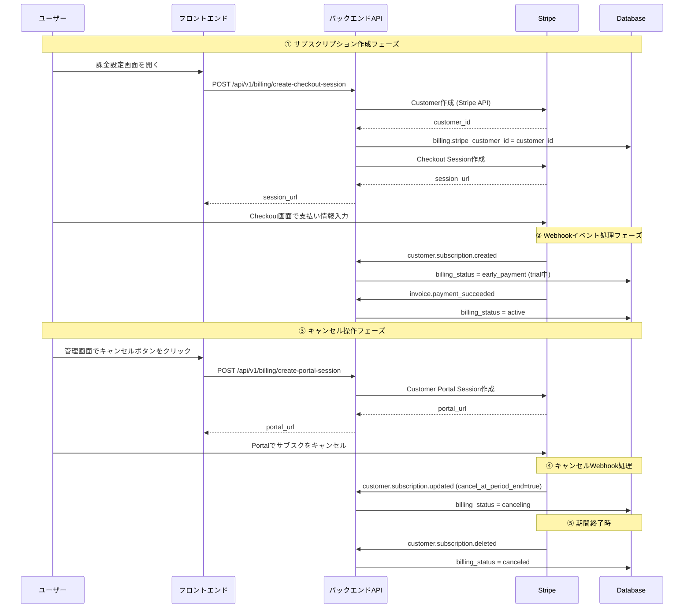

# サブスクリプションキャンセル処理の問題分析

## 問題概要

### 症状
- 登録処理は完了した
- ログを見ると、`customer.subscription.updated`は成功している（キャンセル処理）
- **しかし実際は:**
  - dbにサブスクが登録されている: `sub_1SfWGtBxyBErCNcAFhkG0kw4`
  - カスタマーIDが追加されている
  - **billing_status = active になっている（canceled になっていない）**

### 🔴 真の原因（2025-12-19追記）

**スケジュールされたキャンセル（Scheduled Cancellation）**

アプリケーションログの詳細分析により、真の原因が判明:

```
2025-12-19 04:34:18 - cancel_at_period_end=False, cancel_at=1781574031, status=trialing
                                                     ↑
                                              2026年6月13日 05:00:31 UTC
```

- GUIでキャンセル操作を行った際、**即座に削除されるのではなく将来の日時にキャンセルがスケジュールされた**
- `cancel_at=1781574031` → 2026年6月13日まで`customer.subscription.deleted`イベントは発生しない
- `cancel_at_period_end=False` は「請求期間終了時」ではなく「特定の日時」にキャンセルする設定
- 現在のステータスは`active`のまま（スケジュール済みキャンセル待ち）

**これは仕様上正しい動作であり、バグではありません。**

### CLI実行時の問題

Stripe CLIから`customer.subscription.deleted`を送信した際:
```
2025-12-19 14:20:37  --> customer.subscription.deleted [evt_1Sfw7FBxyBErCNcAb4Cs5364]
2025-12-19 14:20:38  <-- [500] POST http://localhost:8000/api/v1/billing/webhook
エラー: Billing not found for customer cus_TdCWI3BK31JR0U
```

- テスト用カスタマーID（`cus_TdCWI3BK31JR0U`）がDBに存在しない
- Webhookハンドラーが500エラーを返している
- **これは実装の問題（後述の修正提案を参照）**

### Webhookログタイムライン

```
2025-12-18 10:44:54-10:45:07  サブスクリプション作成フロー
  ├─ charge.succeeded
  ├─ customer.subscription.created  ← billing_status: free → early_payment/active
  ├─ payment_intent.succeeded
  ├─ invoice.created
  ├─ invoice.finalized
  ├─ invoice.paid
  ├─ invoice.payment_succeeded     ← billing_status → active
  └─ invoice_payment.paid

2025-12-18 10:47:36  billing_portal.session.created  ← ユーザーがポータルを開いた

2025-12-19 04:34:18  customer.subscription.updated
  ↳ cancel_at_period_end=False, cancel_at=1781574031 (2026-06-13)
  ↳ status=trialing, billing_status=active (変更なし)
  ↳ 理由: スケジュールされたキャンセル（即座削除ではない）

2025-12-19 05:00:35  customer.subscription.updated (同様)
  ↳ cancel_at_period_end=False, cancel_at=1781574031
  ↳ ステータス変更なし

⚠️ customer.subscription.deleted イベントは2026年6月13日まで発生しない（仕様）
```

---

## 利用フロー図

### 1. 正常なサブスクリプション作成〜キャンセルフロー



---

## データフロー図

### Webhook処理のデータフロー（問題箇所）

```
┌─────────────────────────────────────────────────────────────────┐
│ Stripe Webhook: customer.subscription.updated                  │
└─────────────────────────────────────────────────────────────────┘
                              ↓
┌─────────────────────────────────────────────────────────────────┐
│ 1. Webhook受信                                                   │
│    - エンドポイント: POST /api/v1/billing/webhook               │
│    - 署名検証: stripe.Webhook.construct_event()                 │
│    - 冪等性チェック: webhook_events テーブル確認                │
│      ファイル: k_back/app/api/v1/endpoints/billing.py:251-308  │
└─────────────────────────────────────────────────────────────────┘
                              ↓
┌─────────────────────────────────────────────────────────────────┐
│ 2. サービス層で処理                                              │
│    - BillingService.process_subscription_updated()              │
│      ファイル: k_back/app/services/billing_service.py:407-532  │
│                                                                  │
│    処理ロジック:                                                 │
│    ┌─────────────────────────────────────────────────────────┐ │
│    │ subscription_data から以下を取得:                        │ │
│    │ - customer_id                                            │ │
│    │ - cancel_at_period_end (Boolean)                        │ │
│    │ - cancel_at (timestamp)                                 │ │
│    │ - status (active/canceled/etc)                          │ │
│    └─────────────────────────────────────────────────────────┘ │
│                              ↓                                   │
│    ┌─────────────────────────────────────────────────────────┐ │
│    │ 分岐1: cancel_at_period_end == true の場合              │ │
│    │   → billing_status = canceling                          │ │
│    │   (行451-459)                                           │ │
│    └─────────────────────────────────────────────────────────┘ │
│                              ↓                                   │
│    ┌─────────────────────────────────────────────────────────┐ │
│    │ 分岐2: cancel_at_period_end == false の場合             │ │
│    │        かつ現在 billing_status == canceling              │ │
│    │   → billing_status を復元                               │ │
│    │      - trial期間中 + サブスク有 → early_payment         │ │
│    │      - trial期間中 + サブスク無 → free                  │ │
│    │      - 課金期間中 → active                              │ │
│    │   (行462-486)                                           │ │
│    └─────────────────────────────────────────────────────────┘ │
│                              ↓                                   │
│    ┌─────────────────────────────────────────────────────────┐ │
│    │ 分岐3: それ以外の場合                                   │ │
│    │   → ステータス変更なし（通常の更新）                    │ │
│    │   (行487-489)                                           │ │
│    └─────────────────────────────────────────────────────────┘ │
└─────────────────────────────────────────────────────────────────┘
                              ↓
┌─────────────────────────────────────────────────────────────────┐
│ 3. データベース更新                                              │
│    - webhook_events テーブルに記録 (冪等性)                     │
│    - audit_logs テーブルに記録                                  │
│    - billings テーブルのbilling_status更新                      │
│    - 1トランザクションでcommit                                   │
└─────────────────────────────────────────────────────────────────┘
```

---

## 根本原因の特定（確定版）

### 🔴 根本原因: スケジュールされたキャンセル（Scheduled Cancellation）

**確定した原因:**

ログの詳細分析により判明した真の原因:

```
cancel_at_period_end = False
cancel_at = 1781574031 (2026年6月13日 05:00:31 UTC)
status = trialing
```

**Stripeの仕様:**
1. `cancel_at_period_end=true`: 請求期間終了時にキャンセル
2. `cancel_at_period_end=false` + `cancel_at={timestamp}`: 特定の日時にキャンセル（スケジュールキャンセル）
3. 両方とも`null`または`false`: キャンセルされていない

**今回のケース:**
- `cancel_at_period_end=False`（請求期間終了時ではない）
- `cancel_at=1781574031`（2026年6月13日にキャンセル予定）
- **サブスクリプションは2026年6月13日までアクティブのまま**
- **`customer.subscription.deleted`イベントは2026年6月13日に発生する**

### なぜこのような設定になったか

**Stripe Customer Portalの動作:**
1. ユーザーが「キャンセル」ボタンをクリック
2. Stripeが「いつキャンセルしますか？」と選択肢を提示:
   - 即座にキャンセル → `status=canceled`、`customer.subscription.deleted`イベントが即座に発生
   - 請求期間終了時にキャンセル → `cancel_at_period_end=true`
   - **特定の日時にキャンセル → `cancel_at={timestamp}`**
3. ユーザーが「特定の日時」を選択（おそらくテストクロック機能を使用）
4. Stripe側で`cancel_at=1781574031`が設定される
5. アプリケーション側の`billing_status`は`active`のまま（正しい）

### 現在の実装の評価

**✅ 正しく動作している部分:**
- `cancel_at_period_end=false`の場合、ステータスを変更しない（行487-489）
- スケジュールされたキャンセルは`active`のまま維持される（仕様通り）

**❌ 不足している部分:**
1. `cancel_at`が設定されている場合の通知・表示機能がない
2. スケジュールされたキャンセルを示す専用ステータスがない
3. CLI実行時の500エラー（存在しないカスタマーIDのハンドリング）

### 検証方法

```bash
# 1. Stripeでサブスクリプションの詳細を確認
stripe subscriptions retrieve sub_1SfWGtBxyBErCNcAFhkG0kw4

# 期待される出力:
# {
#   "id": "sub_1SfWGtBxyBErCNcAFhkG0kw4",
#   "status": "active" or "trialing",
#   "cancel_at_period_end": false,
#   "cancel_at": 1781574031,  ← これが設定されている
#   "canceled_at": null
# }

# 2. データベースで現在の状態を確認
docker exec -it keikakun_app-db-1 psql -U keikakun -d keikakun_db -c "
SELECT id, billing_status, stripe_subscription_id, trial_end_date
FROM billings
WHERE stripe_subscription_id = 'sub_1SfWGtBxyBErCNcAFhkG0kw4';
"

# 期待される結果:
# billing_status = active (正しい)
```

---

## 修正提案

### 🔴 必須: CLI実行時の500エラー修正

**問題:**
```
Billing not found for customer cus_TdCWI3BK31JR0U
```

存在しないカスタマーIDのWebhookを受信した際、500エラーを返している。
これはStripeに再送を促し、無限ループの原因になる可能性がある。

**修正案:**

```python
# k_back/app/services/billing_service.py:534-607

async def process_subscription_deleted(
    self,
    db: AsyncSession,
    *,
    event_id: str,
    customer_id: str
) -> None:
    try:
        db.expire_all()

        billing = await crud.billing.get_by_stripe_customer_id(
            db=db,
            stripe_customer_id=customer_id
        )

        if not billing:
            # 🆕 変更: 500エラーではなく、警告ログを出して正常終了
            logger.warning(f"[Webhook:{event_id}] Billing not found for customer {customer_id} - skipping (possibly test data)")

            # Webhookイベントだけ記録して成功を返す
            await crud.webhook_event.create_event_record(
                db=db,
                event_id=event_id,
                event_type='customer.subscription.deleted',
                source='stripe',
                billing_id=None,  # billing が存在しない
                office_id=None,
                payload={"customer_id": customer_id, "note": "Customer not found in database"},
                status='skipped',  # 新しいステータス
                auto_commit=True
            )
            return  # 正常終了（500エラーを返さない）

        # ... 既存の処理 ...
```

**同様の修正が必要な箇所:**
- `process_payment_succeeded()` (行148-228)
- `process_payment_failed()` (行230-303)
- `process_subscription_updated()` (行407-532)

---

### 🟡 推奨: スケジュールされたキャンセルの対応

**問題:**
`cancel_at`が設定されている場合、ユーザーに通知する機能がない。

**修正案1: Billingテーブルに`scheduled_cancel_at`カラムを追加**

```sql
-- migration
ALTER TABLE billings ADD COLUMN scheduled_cancel_at TIMESTAMP WITH TIME ZONE;
```

```python
# k_back/app/services/billing_service.py:407

async def process_subscription_updated(
    self,
    db: AsyncSession,
    *,
    event_id: str,
    subscription_data: Dict[str, Any]
) -> None:
    try:
        cancel_at = subscription_data.get('cancel_at')

        # 🆕 追加: cancel_atが設定されている場合、DBに保存
        if cancel_at:
            cancel_at_datetime = datetime.fromtimestamp(cancel_at, tz=timezone.utc)
            await crud.billing.update(
                db=db,
                billing_id=billing.id,
                obj_in={"scheduled_cancel_at": cancel_at_datetime},
                auto_commit=False
            )
            logger.info(f"[Webhook:{event_id}] Scheduled cancellation set for {cancel_at_datetime}")

        # ... 既存の処理 ...
```

**修正案2: BillingStatusに新しいenumを追加**

```python
# k_back/app/models/enums.py

class BillingStatus(str, Enum):
    free = "free"
    early_payment = "early_payment"
    active = "active"
    canceling = "canceling"
    canceled = "canceled"
    past_due = "past_due"
    scheduled_cancel = "scheduled_cancel"  # 🆕 追加
```

```python
# k_back/app/services/billing_service.py:407

async def process_subscription_updated(...):
    cancel_at = subscription_data.get('cancel_at')

    if cancel_at and not cancel_at_period_end:
        # スケジュールされたキャンセル
        await crud.billing.update_status(
            db=db,
            billing_id=billing.id,
            status=BillingStatus.scheduled_cancel,
            auto_commit=False
        )
```

---

### 🟢 任意: デバッグログの強化

**追加すべきログ:**

```python
# k_back/app/services/billing_service.py:435

logger.info(f"[Webhook:{event_id}] Subscription updated - "
            f"customer_id={customer_id}, "
            f"cancel_at_period_end={cancel_at_period_end}, "
            f"cancel_at={cancel_at}, "
            f"status={subscription_status}, "
            # 🆕 追加
            f"subscription_id={subscription_data.get('id')}, "
            f"current_period_end={subscription_data.get('current_period_end')}, "
            f"canceled_at={subscription_data.get('canceled_at')}")
```

---

### 🟡 新規要件: 課金情報表示の強化

**要件概要:**

無料期間中に課金設定を行った場合、または課金をキャンセルした場合に、ユーザーに対して以下の情報を表示する。

#### 要件1: 課金処理日と無料期間残り日数の表示

**表示場所:**
- `/admin`ページのplanタブ

**表示内容:**
1. **課金処理を行った日**: 一番最初に課金設定を行った日時（`subscription_start_date`）
2. **無料期間の残り日数**: `trial_end_date`までの残り日数

**表示条件:**
- `billing_status = early_payment`（無料期間中に課金設定済み）
- `billing_status = active`（課金期間中）
- `billing_status = canceling`（キャンセル予定）
- `billing_status = scheduled_cancel`（スケジュールキャンセル）

**データベース変更:**

既存のカラムを利用:
- `subscription_start_date` (TIMESTAMP): 既に存在、サブスクリプション開始日を記録
- `trial_end_date` (TIMESTAMP): 既に存在、無料期間終了日

**バックエンド実装:**

```python
# k_back/app/schemas/billing.py

from datetime import datetime, timezone
from typing import Optional
from pydantic import BaseModel, Field, computed_field

class BillingStatusResponse(BaseModel):
    billing_status: BillingStatus
    trial_end_date: Optional[datetime] = None
    next_billing_date: Optional[datetime] = None
    current_plan_amount: Optional[int] = None
    subscription_start_date: Optional[datetime] = None  # 🆕 追加
    scheduled_cancel_at: Optional[datetime] = None  # 🆕 追加（スケジュールキャンセル対応）

    @computed_field
    @property
    def trial_days_remaining(self) -> Optional[int]:
        """無料期間の残り日数を計算"""
        if not self.trial_end_date:
            return None
        now = datetime.now(timezone.utc)
        if now >= self.trial_end_date:
            return 0
        delta = self.trial_end_date - now
        return delta.days

    class Config:
        from_attributes = True
```

```python
# k_back/app/api/v1/endpoints/billing.py:48-88

@router.get("/status", response_model=BillingStatusResponse)
async def get_billing_status(
    db: Annotated[AsyncSession, Depends(deps.get_db)],
    current_user: Annotated[Staff, Depends(deps.get_current_user)]
) -> BillingStatusResponse:
    # ... 既存のコード ...

    return BillingStatusResponse(
        billing_status=billing.billing_status,
        trial_end_date=billing.trial_end_date,
        next_billing_date=billing.next_billing_date,
        current_plan_amount=billing.current_plan_amount,
        subscription_start_date=billing.subscription_start_date,  # 🆕 追加
        scheduled_cancel_at=billing.scheduled_cancel_at  # 🆕 追加（要実装）
    )
```

**フロントエンド実装:**

```tsx
// k_front/app/admin/plan/page.tsx

interface BillingStatus {
  billing_status: string;
  trial_end_date: string | null;
  next_billing_date: string | null;
  current_plan_amount: number | null;
  subscription_start_date: string | null;  // 🆕 追加
  scheduled_cancel_at: string | null;  // 🆕 追加
  trial_days_remaining: number | null;  // 🆕 追加
}

// 表示例
{billingStatus.subscription_start_date && (
  <div className="text-sm text-gray-600">
    <p>課金処理日: {new Date(billingStatus.subscription_start_date).toLocaleDateString('ja-JP')}</p>
  </div>
)}

{billingStatus.trial_days_remaining !== null && billingStatus.trial_days_remaining > 0 && (
  <div className="text-sm text-gray-600">
    <p>無料期間残り: {billingStatus.trial_days_remaining}日</p>
  </div>
)}

{billingStatus.scheduled_cancel_at && (
  <div className="text-sm text-orange-600">
    <p>キャンセル予定日: {new Date(billingStatus.scheduled_cancel_at).toLocaleDateString('ja-JP')}</p>
  </div>
)}
```

---

#### 要件2: billing_statusの表示文言変更

**変更内容:**

| billing_status | 現在の表示 | 新しい表示 |
|----------------|------------|------------|
| `free` | 無料 | 無料 |
| `early_payment` | 早期支払い | 課金設定済み（無料期間中） |
| `active` | **有効** | **課金設定済み** |
| `canceling` | キャンセル予定 | キャンセル予定 |
| `canceled` | キャンセル済み | キャンセル済み |
| `past_due` | 支払い遅延 | 支払い遅延 |
| `scheduled_cancel` | - | キャンセル予定（{日時}） |

**フロントエンド実装:**

```tsx
// k_front/app/admin/plan/page.tsx

const getBillingStatusLabel = (status: string, scheduledCancelAt?: string | null): string => {
  switch (status) {
    case 'free':
      return '無料';
    case 'early_payment':
      return '課金設定済み（無料期間中）';
    case 'active':
      return '課金設定済み';  // 🆕 変更: 「有効」→「課金設定済み」
    case 'canceling':
      return 'キャンセル予定';
    case 'canceled':
      return 'キャンセル済み';
    case 'past_due':
      return '支払い遅延';
    case 'scheduled_cancel':
      if (scheduledCancelAt) {
        const date = new Date(scheduledCancelAt).toLocaleDateString('ja-JP');
        return `キャンセル予定（${date}）`;
      }
      return 'キャンセル予定';
    default:
      return status;
  }
};

// 使用例
<p className="text-lg font-semibold">
  {getBillingStatusLabel(billingStatus.billing_status, billingStatus.scheduled_cancel_at)}
</p>
```

---

#### 実装の優先度

1. **🔴 必須**: 表示文言の変更（要件2）
   - フロントエンドのみの変更で対応可能
   - 即座に実装可能

2. **🟡 推奨**: 課金処理日と無料期間残り日数の表示（要件1）
   - バックエンド: スキーマ拡張、computed_field追加
   - フロントエンド: UI追加
   - `subscription_start_date`は既存カラムなので追加実装不要

3. **🟢 任意**: スケジュールキャンセル日時の表示
   - `scheduled_cancel_at`カラムの追加が必要
   - マイグレーション実行後に実装

---

## 検証手順

### ステップ1: 実際のデータを確認

```bash
# 1. Billingテーブルの現在の状態
docker exec -it keikakun_app-db-1 psql -U keikakun -d keikakun_db -c "
SELECT id, office_id, billing_status, stripe_customer_id, stripe_subscription_id
FROM billings
WHERE stripe_subscription_id = 'sub_1SfWGtBxyBErCNcAFhkG0kw4';
"

# 2. Webhookイベントの履歴
docker exec -it keikakun_app-db-1 psql -U keikakun -d keikakun_db -c "
SELECT event_id, event_type, created_at,
       payload->>'cancel_at_period_end' as cancel_at_period_end,
       payload->>'status' as subscription_status
FROM webhook_events
WHERE event_type = 'customer.subscription.updated'
  AND created_at >= '2025-12-18 10:47:00'
ORDER BY created_at;
"

# 3. 監査ログの確認
docker exec -it keikakun_app-db-1 psql -U keikakun -d keikakun_db -c "
SELECT created_at, action, details
FROM audit_logs
WHERE action LIKE 'billing.subscription%'
  AND created_at >= '2025-12-18 10:47:00'
ORDER BY created_at;
"
```

### ステップ2: Stripeの実際の状態を確認

```bash
# Stripe CLIでサブスクリプションの詳細を取得
stripe subscriptions retrieve sub_1SfWGtBxyBErCNcAFhkG0kw4

# 期待される情報:
# - status: "active" or "canceled"
# - cancel_at_period_end: true/false
# - cancel_at: timestamp (キャンセル予定日)
# - canceled_at: timestamp (キャンセル実行日)
```

### ステップ3: 再現テスト

```bash
# 1. テスト用のサブスクリプションを作成
# 2. Customer Portalでキャンセルをクリック
# 3. すぐにキャンセルを取り消す
# 4. DBのbilling_statusを確認
# 5. ログでcancel_at_period_endの変化を確認
```

---

## まとめ

### 🔴 確定した根本原因

**スケジュールされたキャンセル（Scheduled Cancellation）**

1. ユーザーがStripe Customer Portalでキャンセル操作を実行
2. Stripeが`cancel_at=1781574031`（2026年6月13日）を設定
3. `cancel_at_period_end=false`（請求期間終了時ではなく特定日時にキャンセル）
4. `customer.subscription.deleted`イベントは2026年6月13日まで発生しない
5. **現在のステータス`active`は仕様上正しい動作**

### 最終的なステータス（確認済み）

- `billing_status = active`（仕様通り - スケジュールキャンセル待ち）
- `stripe_subscription_id = sub_1SfWGtBxyBErCNcAFhkG0kw4`（サブスクは2026年6月13日まで有効）
- `cancel_at = 1781574031`（2026年6月13日 05:00:31 UTC）
- `customer.subscription.deleted`イベントは将来発生予定

### 🔴 実際に修正が必要な問題

**CLI実行時の500エラー:**
```
Billing not found for customer cus_TdCWI3BK31JR0U
```

- テスト用カスタマーIDがDBに存在しない
- 500エラーを返すとStripeが無限に再送する
- **修正必須**: 存在しないカスタマーIDの場合、警告ログを出して200を返す

### 対応方針（優先度順）

1. **🔴 必須**: CLI実行時の500エラー修正
   - `process_subscription_deleted()`で存在しないカスタマーを適切にハンドリング
   - 他のWebhook処理メソッドにも同様の修正を適用

2. **🔴 必須**: 表示文言の変更（新規要件）
   - `billing_status=active`の表示を「有効」→「課金設定済み」に変更
   - フロントエンドのみの変更で対応可能

3. **🟡 推奨**: 課金処理日と無料期間残り日数の表示（新規要件）
   - バックエンド: `BillingStatusResponse`に`subscription_start_date`と`trial_days_remaining`を追加
   - フロントエンド: `/admin`のplanタブに課金処理日と無料期間残り日数を表示
   - 既存カラムを利用するため、マイグレーション不要

4. **🟡 推奨**: スケジュールされたキャンセルへの対応
   - `scheduled_cancel_at`カラムをBillingテーブルに追加
   - または`BillingStatus.scheduled_cancel`を追加
   - フロントエンドでスケジュール情報を表示

5. **🟢 任意**: デバッグログの強化
   - `cancel_at`、`current_period_end`、`canceled_at`をログに追加

### 関連ファイル

- Webhookエンドポイント: `k_back/app/api/v1/endpoints/billing.py:251-366`
- サブスクリプション削除処理: `k_back/app/services/billing_service.py:534-607` ← 500エラー箇所
- サブスクリプション更新処理: `k_back/app/services/billing_service.py:407-532`
- 支払い成功処理: `k_back/app/services/billing_service.py:148-228`
- 支払い失敗処理: `k_back/app/services/billing_service.py:230-303`
